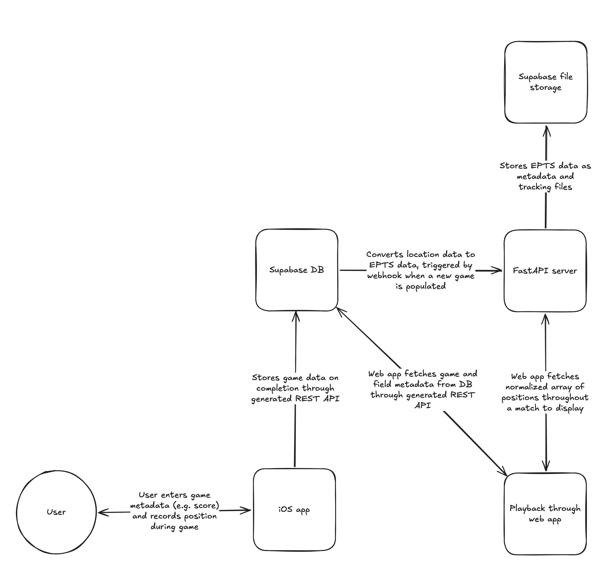

# Soccer Position Tracker

### What is this?
This is an exercise in working with [EPTS data](https://digitalhub.fifa.com/m/477d8daa7f0ac4c9/original/standard-transfer-format-documentation.pdf), a standard format by FIFA for tracking the position of soccer players and the ball.

In short, this project:
1. Tracks my position during games
1. Converts position data into the EPTS format
1. Allows for visual playback of tracked games

### Tech used
- Swift + SwiftUI
- FastAPI
- Supabase
- Svelte + SvelteKit
